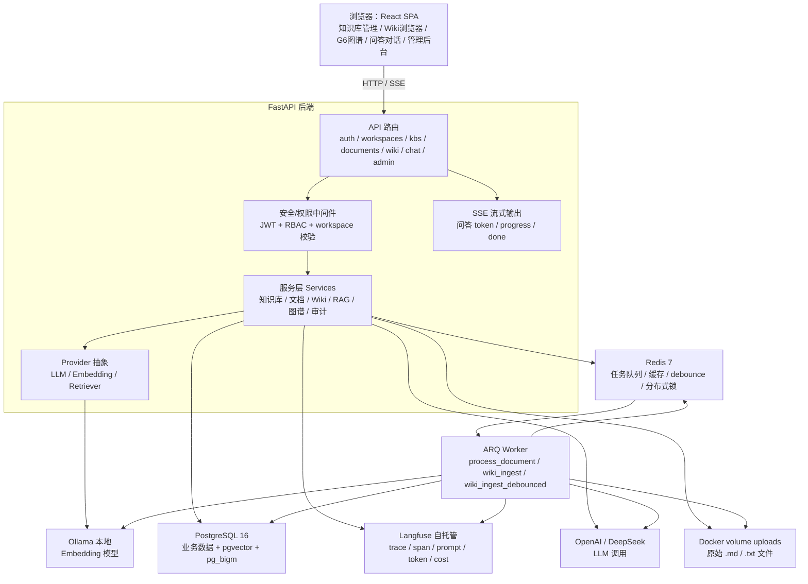
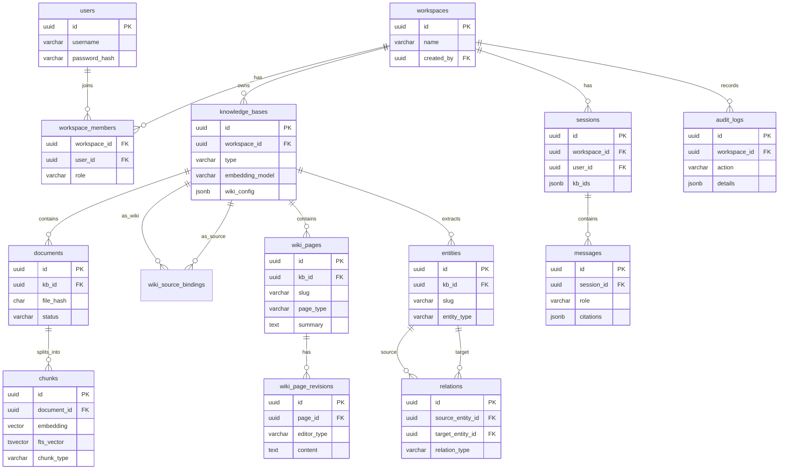
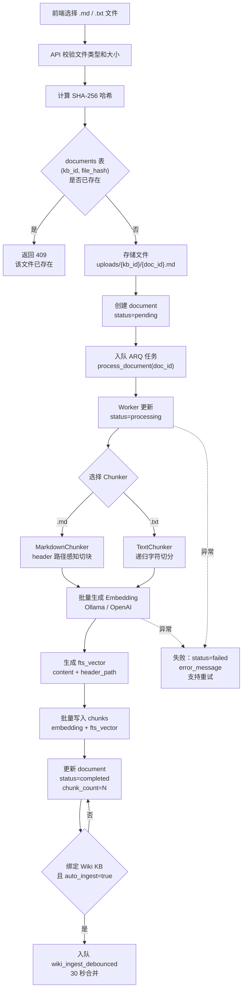
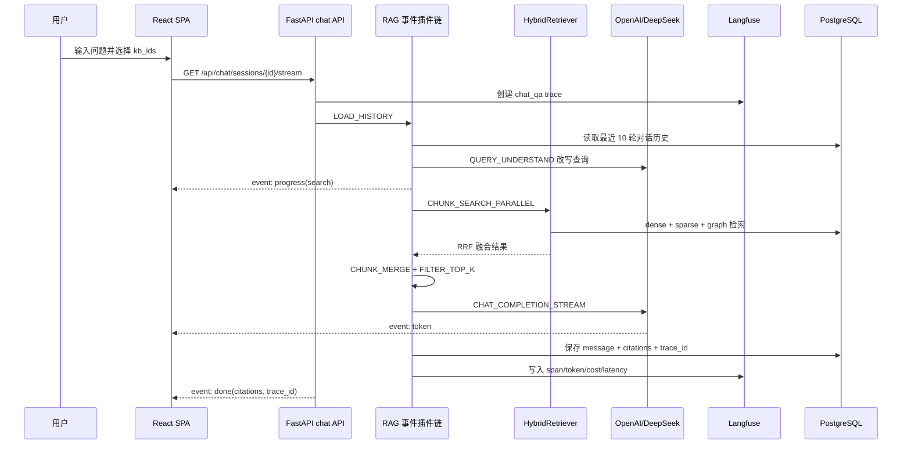
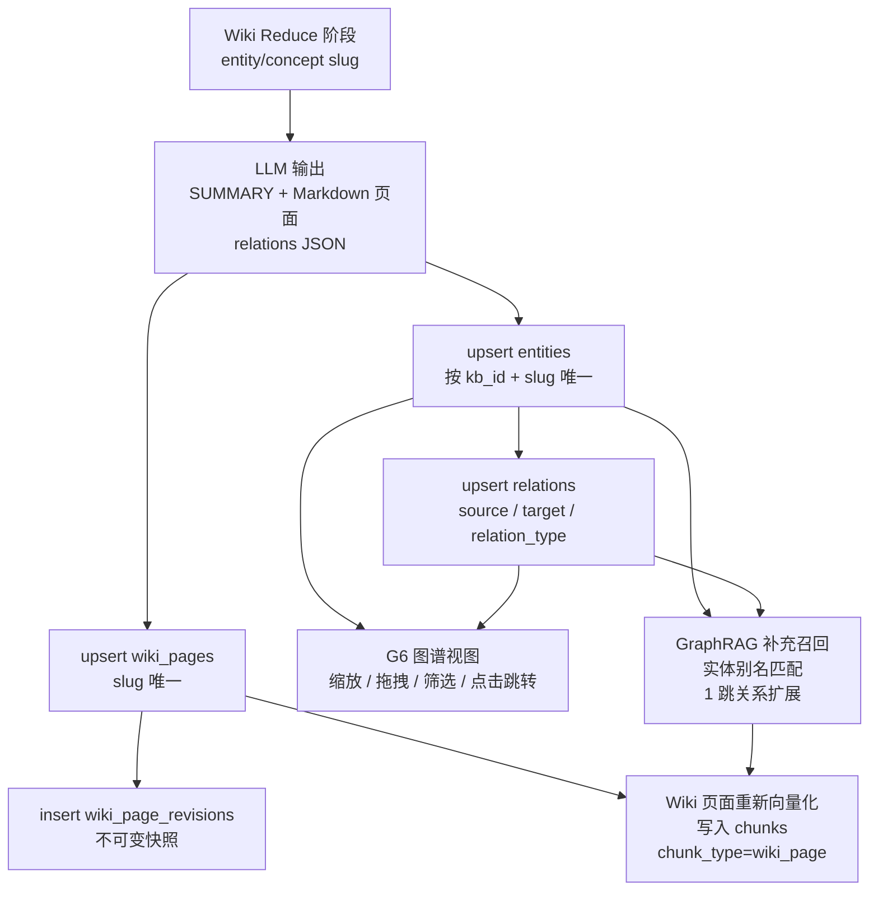
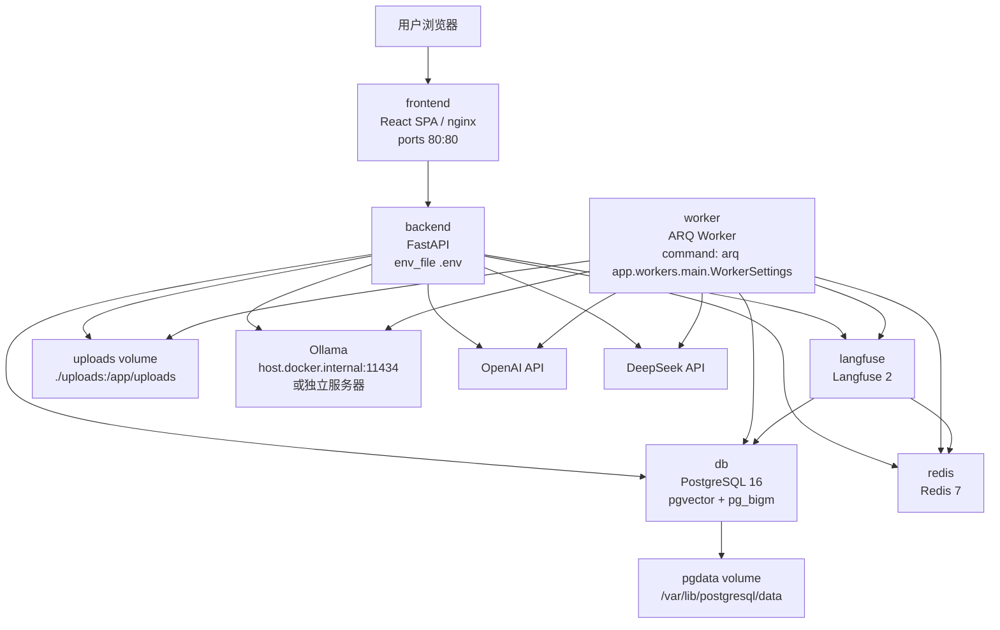

# Architecture：企业内部 LLM Wiki 知识库系统

> 版本：v1.1
> 日期：2026-08-27
> 状态：草案
> 来源文档：[PRD-LLM-Wiki知识库系统.md](./PRD-LLM-Wiki知识库系统.md)、[TRD-LLM-Wiki知识库系统.md](./TRD-LLM-Wiki知识库系统.md)

---

## 1. 文档定位

本文档是 LLM Wiki 知识库系统的架构文档，沉淀 PRD 与 TRD 中跨模块、跨流程的技术细节，并用 Mermaid 图补充说明系统结构、数据关系、核心流程和部署拓扑。

- 产品定位、用户角色、功能需求、非功能需求以 [PRD](./PRD-LLM-Wiki知识库系统.md) 为准。
- 技术选型、项目结构、数据库字段、API、异步任务、环境变量以 [TRD](./TRD-LLM-Wiki知识库系统.md) 为准。
- 系统级架构边界、核心数据流、流程关系和架构决策以本文档为阅读入口。

---

## 2. 架构目标与原则

系统不仅存储和检索文档，还通过 LLM 流水线自动将原始文档蒸馏为结构化、互链的 Wiki 知识库，并构建可视化知识图谱。核心范式转变是：

```text
传统 RAG：原始文档 → [检索] → LLM → 一次性回答（丢弃）
LLM Wiki：原始文档 → [ingest] → Wiki（持久化、持续更新）→ [检索] → LLM → 回答
```

架构原则沿用 TRD：

1. **流水线而非自由 Agent**：Wiki ingest 使用固定六阶段流水线，每阶段职责单一、可独立观测。
2. **事件插件链**：RAG 问答管线按固定阶段拆分，每个检索/处理阶段实现为插件，可插拔。
3. **异步优先**：文档解析、Wiki ingest 等长任务全部走 ARQ 异步队列，API 立即返回任务 ID。
4. **可观测优先**：所有 LLM 调用、检索、Agent 步骤均接入 Langfuse，trace ID 贯穿全链路。
5. **模块化**：LLM Provider、Embedding Provider、检索器均为抽象接口，可扩展。

---

## 3. 系统上下文与服务边界

系统由浏览器端 React SPA、FastAPI 后端、ARQ Worker、PostgreSQL、Redis、Langfuse、Ollama 与外部 LLM API 组成。React SPA 通过 HTTP / SSE 访问后端；后端承担认证授权、API 路由、服务编排、问答流式输出；Worker 承担文档解析、向量化、Wiki ingest 等长任务。



核心技术决策汇总：

| 项 | 决策 |
|---|---|
| 后端框架 | FastAPI（Python 3.12+，async） |
| 前端框架 | React 18 + Vite + TypeScript |
| UI 组件库 | shadcn/ui + Tailwind CSS |
| 图谱可视化 | @antv/g6 |
| ORM | SQLAlchemy 2.0（async） |
| 数据库迁移 | Alembic |
| 关系数据库 | PostgreSQL 16 + pgvector + pg_bigm |
| 缓存/任务队列 | Redis 7 + ARQ |
| 认证 | JWT（access + refresh token）+ bcrypt |
| LLM | OpenAI、DeepSeek |
| Embedding | Ollama 本地、OpenAI API |
| 可观测性 | Langfuse（自托管） |
| 流式输出 | SSE（问答）/ 轮询（Wiki ingest） |
| 部署 | Docker Compose |
| Wiki ingest | 结构化六阶段流水线（非 ReAct 自由循环） |

---

## 4. 核心领域模型

核心概念沿用 PRD。Workspace 是资源隔离的基本单位；Source KB 存储原始上传文档，类型为 `document`；Wiki KB 由流水线自动生成和维护，类型为 `wiki`，绑定一个或多个 Source KB；Chunk 是文档经过切分后的最小检索单元，携带标题路径上下文。

| 概念 | 定义 |
|---|---|
| **团队（Workspace）** | 资源隔离的基本单位，知识库、文档、成员都归属于团队 |
| **源知识库（Source KB）** | 存储原始上传文档的知识库，类型为 `document` |
| **Wiki 知识库（Wiki KB）** | 由流水线自动生成和维护的 Wiki，类型为 `wiki`，绑定一个或多个 Source KB |
| **Wiki 页面** | Wiki 中的一篇 Markdown 页面，有明确的类型（索引/摘要/实体/概念/综述/分析） |
| **知识图谱** | 从文档中抽取的实体及其关系，支持可视化浏览和图谱检索 |
| **Chunk（分块）** | 文档经过切分后的最小检索单元，携带标题路径上下文 |
| **Ingest（摄入）** | 新文档加入 Source KB 后，触发六阶段流水线读取文档并增量更新 Wiki 的过程 |

Source KB 与 Wiki KB 的关系：

- Source KB 和 Wiki KB 是**分离的**两类知识库。
- 一个 Wiki KB 可绑定一个或多个 Source KB，形成"原始资料 → 综合知识"的关系。
- Source KB 中的文档是不可变的原始资料（ground truth），系统只读不写。
- Wiki KB 中的页面由流水线自动生成和维护，用户可浏览、编辑。
- 一个团队可有多个 Source KB 和多个 Wiki KB，自由组合绑定。



---

## 5. 数据与存储架构

系统不引入独立向量数据库或独立图数据库，统一使用 PostgreSQL 16 承载业务数据、pgvector 向量检索、pg_bigm 中文全文检索和 entities/relations 图谱关系。Redis 负责 ARQ 队列、缓存、Wiki ingest debounce 和分布式锁。原始上传文件存储在 Docker volume 中，不暴露为静态资源，通过 API 鉴权访问。

关键存储职责：

| 存储 | 职责 |
|---|---|
| PostgreSQL | users、workspaces、knowledge_bases、documents、wiki_pages、sessions、audit_logs 等业务数据 |
| pgvector | `chunks.embedding`，支持 Dense 向量检索，使用 cosine distance |
| pg_bigm | `chunks.fts_vector` 或 content/header_path 组合文本，支持中文关键词检索 |
| Redis | ARQ 队列、任务缓存、`wiki:ingest:{kb_id}`、`wiki:slug:{kb_id}:{slug}` 等锁 |
| uploads volume | `uploads/{kb_id}/{doc_id}.md` 等原始文件 |
| Langfuse | trace、span、prompt、response、tokens、cost、latency |

重要一致性边界：

- Embedding 模型在创建知识库时选择，选定后不可更改，向量维度由所选模型决定。
- 删除文档时同时删除其所有分块和向量索引；若文档已被 Wiki KB 摄入，Wiki KB 中对应来源页标记为"来源已删除"，不自动删除 Wiki 页面。
- Wiki 页面写入时创建不可变修订快照；回滚是以旧版本内容创建新修订，不删除历史。
- Wiki 页面也作为 chunk 入库，`chunk_type=wiki_page`，通过 `source_page_id` 关联 Wiki 页面。
- 所有查询强制带 workspace_id 条件；知识库访问校验要求用户必须是该 KB 所属团队的成员。

---

## 6. 文档上传与处理架构

文档上传支持 Markdown（`.md`）和纯文本（`.txt`），支持单文件上传和批量上传。后端计算 SHA-256 哈希，并在同一知识库内查重；重复文件返回提示"该文件已存在"，拒绝重复上传。异步处理阶段读取文件、分块、向量化、写入向量索引，并更新文档状态。



Markdown 分块保留标题路径：

- 按 `#`（H1）、`##`（H2）、`###`（H3）标题边界切节。
- 每个 chunk 记录 `header_path` 字段，如 `["产品介绍", "计费方式", "关键词快车"]`。
- 超长章节在该节内按段落/句子递归切分，二次切分产生的所有子 chunk 共享同一个 `header_path`。
- 相邻 chunk 间保留 80 字符重叠，标题边界处不重叠。
- Embedding 输入为 `" > ".join(header_path) + "\n" + content`。
- BM25 全文检索同样将 `header_path` 拼入索引文本。

---

## 7. Wiki Ingest 架构

Wiki 生成采用**结构化六阶段流水线**，而非 ReAct 自由循环。流水线每阶段职责单一、可独立观测和重试。触发方式包括手动触发和自动触发；自动触发时采用 debounce 合并，30 秒内多次上传合并为一个批次处理。

```mermaid
flowchart LR
    trigger["wiki_ingest 触发<br/>手动 / 自动 debounce"]
    lock["Redis 锁<br/>wiki:ingest:{kb_id}<br/>同一 Wiki KB 串行"]
    ops["task_pending_ops<br/>按文档 claim<br/>pending -> claimed"]
    prepare["阶段 0：准备<br/>待处理文档 / 已有 slug / 已有分类目录"]
    extract["阶段 1：Extract<br/>WikiCandidateSlugPrompt<br/>实体/概念骨架<br/>复用 previous_slugs"]
    citation["阶段 2：Citation<br/>WikiChunkCitationPrompt<br/>候选 slugs + chunks<br/>{slug:[chunk_id]} + new_slugs"]
    taxonomy["阶段 3：Taxonomy<br/>WikiTaxonomyPlanPrompt<br/>category_path 最多 2 级<br/>复用已有分类"]
    summary["阶段 4：Summary<br/>WikiSummaryPrompt<br/>source/{doc_id}<br/>SUMMARY + Key Takeaways + 双链"]
    reduceLock["Redis slug 锁<br/>wiki:slug:{kb_id}:{slug}"]
    reduce["阶段 5：Reduce<br/>WikiPageModifyPrompt<br/>已有页面 + verbatim chunks<br/>SUMMARY + Markdown + relations JSON"]
    tx["Per-slug 事务<br/>wiki_page upsert<br/>wiki_page_revision<br/>entities / relations upsert"]
    post["阶段 6：Post-process<br/>双链注入 / 死链清理<br/>overview.md / index.md<br/>重新向量化 wiki_page chunks"]
    done["标记任务完成<br/>记录 audit_logs<br/>写入 Langfuse trace/span"]
    failed["文档粒度失败<br/>status=failed<br/>可单独重试"]

    trigger --> lock --> ops --> prepare --> extract --> citation --> taxonomy --> summary --> reduceLock --> reduce --> tx --> post --> done
    extract -. "单文档失败" .-> failed
    citation -. "非法 JSON / LLM 失败" .-> failed
    summary -. "单文档失败" .-> failed
    reduce -. "单 slug 失败" .-> failed
```



六阶段职责：

| 阶段 | 名称 | LLM 调用 | 说明 |
|---|---|---|---|
| 1 | Extract | 每文档 1 次 | 抽取实体/概念骨架（name/slug/aliases/description），保证 slug 连续性 |
| 2 | Citation | 每文档分批 | 标注每个 slug 引用了哪些 chunk，可发现新 slug |
| 3 | Taxonomy | 每批次 1 次 | 为新 slug 分配 category_path（最多 2 级），复用已有分类 |
| 4 | Summary | 每文档 1 次 | 生成来源摘要页（SUMMARY + Key Takeaways + 双链） |
| 5 | Reduce | 每 slug 1 次 | 归并 chunk 原文 + 已有页面，生成/更新实体/概念页，写入实体关系 |
| 6 | Post-process | overview 1 次 | 双链注入、死链清理、index/overview 更新、重新向量化 |

上下文管理关键参数：

| 参数 | 值 | 说明 |
|---|---|---|
| max_document_content | 32 KB | 单文档进入 LLM 的内容上限 |
| chunks_per_citation_batch | ~20 | 引用标注每批 chunk 数（根据模型上下文窗口调整） |
| max_reduce_chars | 8000 | 归并阶段引用 chunk 原文总字符上限 |
| wiki_ingest_debounce | 30 秒 | 自动触发时的合并窗口 |
| llm_timeout | 60 秒 | 单次 LLM 调用超时 |
| llm_max_retries | 3 | LLM 调用失败重试次数（429 限流固定 backoff 60 秒） |

并发控制：

- 同一 Wiki KB 同时只允许一个 ingest 任务（Redis 锁 `wiki:ingest:{kb_id}`）。
- 不同 Wiki KB 可并行。
- 阶段 5 归并按 slug 加锁（`wiki:slug:{kb_id}:{slug}`），防止同一页面并发写入冲突。
- LLM 调用支持重试（429 限流时 backoff 60 秒）。
- 任务状态写入 `task_pending_ops` 表，支持崩溃恢复（claim 超过 90 分钟视为 stale，可重新 claim）。

原子性与失败处理：

- **Per-slug 事务**：阶段 5 归并写入单个 slug 时，在一个数据库事务中完成 wiki_page upsert + wiki_page_revision 插入 + entities/relations upsert，保证单个页面的原子性。
- **Per-document 任务追踪**：`task_pending_ops` 以文档为粒度记录状态（payload 含 doc_id），而非整个批次一个状态。一篇文档失败不影响其他文档。
- **部分成功可接受**：已成功生成的页面保留并立即可用，不回滚。失败的文档标记为 failed，用户可单独重试。
- **不追求全局事务**：整个 ingest 批次不包在一个大事务中，避免长事务和大量 LLM 调用期间持锁。
- **幂等重试**：重试时按 slug 做 upsert（已有页面走归并更新路径），不会产生重复页面。

Prompt 设计要点：

- **WikiCandidateSlugPrompt**：只抽骨架（name/slug/aliases/description/details），不写完整事实；传入 previous_slugs 保证连续性。
- **WikiChunkCitationPrompt**：输入候选 slugs + 一批 chunk，输出每个 slug 引用了哪些 chunk ID；可发现 new_slugs；静态指令在前、chunks 在后以利用 prompt cache。
- **WikiTaxonomyPlanPrompt**：输入已有文件夹 + 新条目列表，输出每个条目的 category_path；强制复用已有文件夹标签。
- **WikiSummaryPrompt**（阶段4）：每篇文档单独调用，输入文档内容（截断 32KB）+ 阶段1抽取的可用 slug 列表（含 display name + aliases），输出 SUMMARY 行 + Markdown 摘要（含 Key Takeaways），自动加 `[[slug|名称]]` 双链；不传文件名（避免无意义文件名导致幻觉）。
- **WikiPageModifyPrompt**（System + User，阶段5）：System 为共享规则（溯源、禁止幻觉、编译者角色、链接规则、冲突处理）；User 为页面元数据 + 已有内容 + 新信息（verbatim chunk）+ 合法链接白名单；首行必须输出 `SUMMARY: ...`。
- **WikiIndexIntroPrompt / Update**：index 页引言生成/更新。

---

## 8. 检索与 RAG 问答架构

问答时采用三路并行检索 + RRF 融合。用户提问前选择要查询的知识库，可多选 Source KB 和/或 Wiki KB。RAG 问答管线按固定阶段拆分为事件插件链，回答采用 SSE 流式输出，完成后返回引用来源和 trace_id。

```mermaid
flowchart TD
    query["用户问题"]
    rewrite["QUERY_UNDERSTAND<br/>多轮上下文改写为独立查询<br/>意图：kb_search / greeting / chitchat"]
    embedding["生成 query embedding"]
    dense["Dense 向量检索<br/>pgvector cosine<br/>Top-20"]
    sparse["Sparse BM25 检索<br/>pg_bigm<br/>Top-20"]
    graph["GraphRAG 图谱检索<br/>实体名/别名字符串匹配<br/>relations 1 跳扩展<br/>Top-20"]
    rrf["RRF 融合<br/>score = sum 1/(k + rank)<br/>k=60"]
    boost["Wiki 页面 boost<br/>chunk_type=wiki_page<br/>boost=1.2"]
    topk["阈值过滤 + Top-N<br/>默认 Top-8"]
    prompt["组装 Prompt<br/>检索片段编号 + 历史 + 查询"]
    completion["LLM SSE 流式生成"]
    citations["返回 answer + citations + trace_id"]
    fallback["无结果 fallback<br/>不编造答案"]

    query --> rewrite --> embedding
    embedding --> dense
    rewrite --> sparse
    rewrite --> graph
    dense --> rrf
    sparse --> rrf
    graph --> rrf
    rrf --> boost --> topk
    topk -- "有结果" --> prompt --> completion --> citations
    topk -- "无结果" --> fallback
```

检索路径：

| 检索路径 | 说明 |
|---|---|
| **Dense 向量检索** | 问题向量化后，在 pgvector 中做余弦相似度检索，召回语义相关 chunk |
| **Sparse BM25 检索** | 问题分词后在 PostgreSQL 全文索引中做关键词检索，召回精确匹配 chunk |
| **GraphRAG 图谱检索** | 从问题中字符串匹配实体名/别名 → 沿知识图谱关系扩展 1 跳 → 召回关联实体的 Wiki 页面 chunk 作为补充 |

RRF 融合策略：

```text
score(chunk) = Σ 1/(k + rank_i(chunk))    # k = 60
```

- 三路检索并行执行，各自返回 Top-K 结果。
- 用 RRF 融合排名，无需调参，对各路分数尺度不敏感。
- Wiki 页面 chunk 在融合时给予轻微权重加成（预综合内容质量更高）。
- 融合后取 Top-N（默认 8）进入 LLM 上下文。

GraphRAG 定位：

- Wiki 模式下实体/概念页本身已作为 chunk 入索引，向量+BM25 检索能自然命中相关 Wiki 页面。
- 图谱检索定位为**补充召回**，而非必需路径；当图遍历召回不足时，主检索链路仍由向量检索和 BM25 保证可用性。
- 查询时不做 LLM 实体抽取，避免额外延迟和成本。
- 图谱扩展范围为 1 跳关联实体。
- 图检索无命中时不影响主流程，向量+BM25 仍可正常召回 Wiki 页面。

RAG 问答 SSE 时序：



事件插件链：

| 阶段 | 职责 |
|---|---|
| LOAD_HISTORY | 加载最近 10 轮对话历史 |
| QUERY_UNDERSTAND | LLM 调用：将多轮指代改写为独立查询，同时判断意图 |
| CHUNK_SEARCH_PARALLEL | 三路并行检索，SSE 推送进度："正在检索知识库..." |
| CHUNK_MERGE | 同文档相邻 chunk 合并（去 overlap）、去重、组装 header_path 面包屑 |
| FILTER_TOP_K | 阈值过滤、取 Top-8、无结果 fallback |
| INTO_CHAT_MESSAGE | 组装 System、Context、History、User prompt |
| CHAT_COMPLETION_STREAM | LLM 流式生成，完成后推送 citations |

引用溯源要求：

- 检索片段进入 LLM 上下文时带编号 `[1]`、`[2]`。
- System Prompt 要求 LLM 在回答中使用 `[1]` 角标引用。
- 引用元数据包含 document_id、filename、header_path、chunk 内容片段。
- 前端渲染角标可 hover 显示来源卡片，点击跳转到原文/Wiki 页面。
- Wiki 页面来源和原始文档来源用不同图标区分。

---

## 9. Wiki 页面与知识图谱架构

Wiki KB 包含六类页面，由流水线在 ingest 过程中按需创建和更新：索引页、来源摘要页、实体页、概念页、全局综述页、分析页。每个 Wiki 页面由数据库元信息字段和 Markdown 正文两部分组成，正文首行为 `SUMMARY:` 摘要行，后处理时解析为 summary 字段，不渲染在正文中。

页面间使用 `[[slug|显示名称]]` 双链语法互链，slug 唯一，避免重名歧义。关联关系不写在正文固定章节中，而是通过双链和知识图谱（entities/relations 表）体现。所有页面同时进入向量索引，参与检索。

知识图谱存储在 PostgreSQL 关系表中，不引入独立图数据库：

- `entities` 表：实体名称、类型、描述、首次出现文档、关联 Wiki 页面。
- `relations` 表：源实体、目标实体、关系类型、出处文档。
- 流水线在阶段 5（Reduce）归并写入页面时，LLM 同时输出实体关系列表，同步写入 entities/relations 表。
- 实体与 Wiki 实体页/概念页双向关联。



图谱可视化：

- Wiki KB 提供"图谱"视图。
- 使用交互式图库展示实体节点和关系边。
- 支持缩放、拖拽、点击节点跳转到对应 Wiki 页面。
- 支持按关系类型和实体类型筛选显示。
- 节点大小/颜色按实体类型区分。

---

## 10. 安全与权限架构

系统采用账号密码注册和登录。首次注册的用户自动创建一个团队并成为管理员。角色在团队内分配，包括管理员（Admin）、编辑者（Editor）、查看者（Viewer）。一个用户可属于多个团队，在不同团队中可拥有不同角色。

安全实现约束：

| 维度 | 要求 |
|---|---|
| 认证 | 密码 bcrypt 哈希（cost=12）；JWT access token 30 分钟，refresh token 7 天 |
| 授权 | 所有 API 除 register/login 外需携带 access token；团队资源访问校验中间件从 JWT 提取 user_id 后查 workspace_member |
| 数据隔离 | 所有查询强制带 workspace_id 条件；Wiki KB 只能绑定同团队的 Source KB |
| 敏感信息 | LLM/Embedding API Key 使用 AES-256-GCM 加密存储；API 响应不返回明文，只返回掩码 + 是否已配置 |
| 文件上传 | 仅允许 .md/.txt；限制单文件大小（默认 10MB，可配置）；文件名消毒，防止路径穿越 |
| 审计 | 所有写操作记入 audit_logs，包括文档上传/删除、Wiki 生成/编辑/回滚、成员变更、知识库设置变更 |

---

## 11. 可观测性架构

集成 **Langfuse** 作为统一可观测性平台，覆盖 LLM 调用链路、检索过程、Wiki 流水线、文档解析进度和系统指标。管理员和编辑者可访问可观测性面板；每次问答和 Wiki 生成都有唯一 trace ID，可在 Langfuse 中查看完整调用链。

所有关键操作创建 Langfuse trace/span：

| 操作 | Trace | Span |
|---|---|---|
| 文档处理 | `document_process` | chunking、embedding |
| Wiki ingest | `wiki_ingest` | extract、citation（每文档）、taxonomy、summary（每文档）、reduce（每slug）、postprocess |
| 问答 | `chat_qa` | query_understand、search（dense/sparse/graph）、merge、completion |
| LLM 调用 | （子 span） | model、prompt、response、tokens、cost、latency |

可观测性要求：

- 每个 trace 携带 workspace_id、kb_id、user_id 作为 metadata。
- 问答响应中返回 trace_id，管理员可在 Langfuse UI 中查看完整链路。
- Wiki ingest 每阶段的 LLM 输入/输出均记录，方便调试生成质量。
- Python 标准 logging + structlog 输出 JSON 结构化日志。
- 关键操作记录到 audit_logs 表，作为业务审计。

---

## 12. Docker Compose 部署架构

部署方式为 Docker Compose 一键部署。核心容器包括 Web 前端、Python 后端、PostgreSQL（含 pgvector）、Redis、Langfuse、ARQ Worker。Ollama 由用户在宿主机或独立服务器自行部署，通过 `OLLAMA_BASE_URL` 配置地址。



部署细节：

- PostgreSQL 镜像需要自定义 Dockerfile 安装 pg_bigm：

```dockerfile
FROM pgvector/pgvector:pg16
RUN apt-get update && apt-get install -y postgresql-16-pgbigm
```

- 初始化时执行 `CREATE EXTENSION IF NOT EXISTS vector; CREATE EXTENSION IF NOT EXISTS pg_bigm;`。
- Ollama 推荐 Embedding 模型：`bge-m3`（1024 维）或 `nomic-embed-text`（768 维）。
- docker-compose 中可添加 `network_mode: host` 或 `extra_hosts: host.docker.internal:host-gateway` 访问宿主机 Ollama。

环境变量分组：

| 分组 | 示例 |
|---|---|
| Database | `DATABASE_URL` |
| Redis | `REDIS_URL` |
| JWT | `JWT_SECRET`、`ACCESS_TOKEN_EXPIRE_MINUTES`、`REFRESH_TOKEN_EXPIRE_DAYS` |
| Encryption | `ENCRYPTION_KEY` |
| LLM | `OPENAI_API_KEY`、`OPENAI_BASE_URL`、`DEEPSEEK_API_KEY`、`DEEPSEEK_BASE_URL` |
| Embedding | `OLLAMA_BASE_URL`、`OLLAMA_EMBED_MODEL`、`OPENAI_EMBED_MODEL` |
| Langfuse | `LANGFUSE_HOST`、`LANGFUSE_PUBLIC_KEY`、`LANGFUSE_SECRET_KEY` |
| Storage | `UPLOAD_DIR`、`MAX_FILE_SIZE_MB` |
| App | `DEFAULT_CHUNK_SIZE`、`DEFAULT_CHUNK_OVERLAP`、`WIKI_MAX_DOC_CONTENT_KB`、`RRF_K`、`CHAT_HISTORY_TURNS` |

---

## 13. 架构决策记录

| 决策 | 结果 | 说明 |
|---|---|---|
| Wiki ingest 使用固定流水线 | 结构化六阶段流水线，非 ReAct 自由循环 | 每阶段职责单一、可独立观测和重试，降低生成过程不可控性 |
| GraphRAG 定位为补充召回 | Dense + Sparse 仍是主检索链路 | 当图遍历召回不足时，主检索链路仍由向量检索和 BM25 保证可用性 |
| 不引入独立图数据库 | entities/relations 存储在 PostgreSQL 关系表 | 当前需求是可视化浏览与 1 跳关系补充召回，PostgreSQL 足够承载 |
| Wiki 页面进入统一 chunk 索引 | `chunk_type=wiki_page`，并关联 `source_page_id` | Wiki 页面作为预综合内容参与 Dense/Sparse 检索 |
| Embedding 模型创建后不可更改 | 更换模型需重建索引 | 向量维度由所选模型决定，混用会破坏索引一致性 |
| 不追求 ingest 全局事务 | per-document 任务追踪 + per-slug 事务 | 避免长事务和大量 LLM 调用期间持锁，允许部分成功并支持单文档重试 |
| 问答使用 SSE | token/progress/done 事件流式返回 | 满足首字延迟和用户感知进度要求 |
| Docker Compose 作为默认部署 | 前端、后端、worker、db、redis、langfuse 组合部署 | 满足企业内部自托管与一键部署诉求 |

